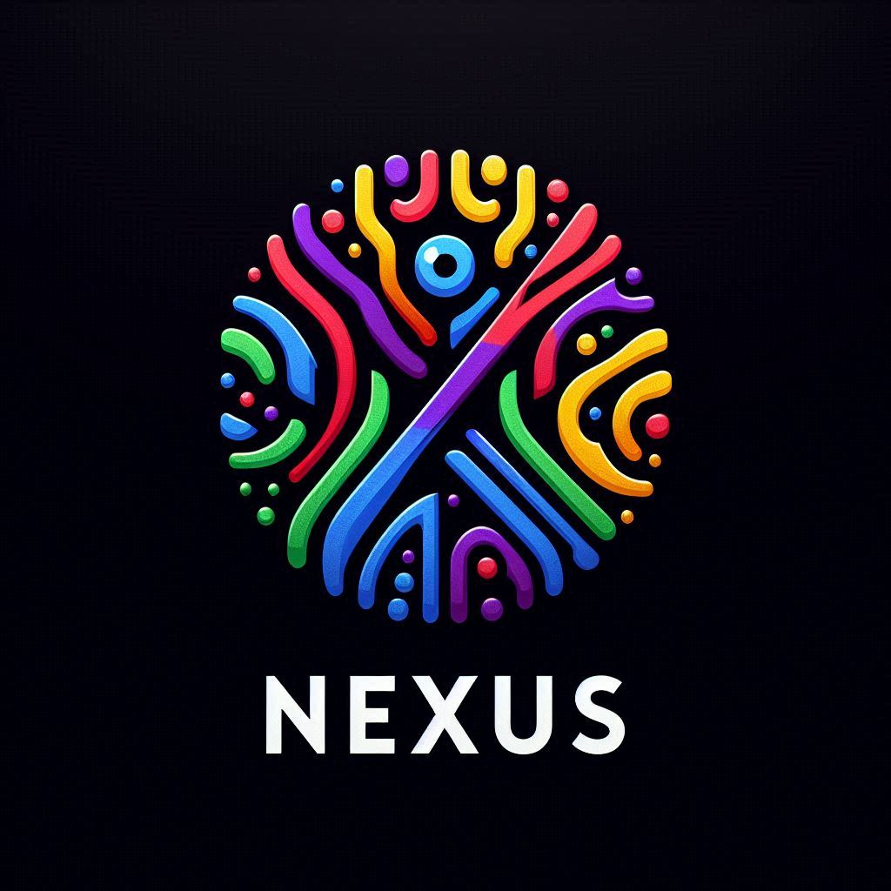

# Nexus T1 AI

🍄🤖 **Nexus T1 AI** 🤖🍄

🌍 🌱 

## Technologies Used
- **C**: Implementing core functionalities for performance-critical components.
- **Java**: Building reliable applications and managing complex business logic.
- **Node.js**: Handling backend processes and facilitating frontend communication.
- **Shell Script**: Automating tasks and enhancing system integration.
- **Rubyx**: Scripting and developing ancillary tools for improved workflows.
- **Lua**: Lightweight scripting for extensibility and customization.
- **Go**: Crafting efficient and scalable services for high-demand applications.

## Description
Nexus T1 AI is an innovative platform developed by HoloFi, focusing on artificial intelligence and decentralized applications (DApps). By leveraging cutting-edge technologies, Nexus T1 AI aims to deliver secure, efficient, and intelligent solutions for digital asset management and smart contract functionalities.

## Prerequisites
- Compilers for **C** and **Java** installed on your system.
- **Node.js** and **npm** for managing dependencies and running backend services.
- **Rubyx** and **Lua** for scripting and automation tasks.
- A configured **Shell** environment for executing scripts.
- **Go** set up for service development.
- Fundamental understanding of C, Java, Node.js, Shell, Rubyx, Lua, and Go.

## Instructions for Use

### Clone the Repository
```bash
git clone https://github.com/nscinc/nexus-t1-ai.git
```

### Install Dependencies
```bash
cd nexus-t1-ai
npm install
```

### Configure the Nexus T1 AI Network
- Ensure your Nexus T1 AI client is operational and synchronized.
- Set up environment variables in the `.env` file with details for your HoloFi network.

### Deploy Smart Contracts
- Compile and deploy necessary smart contracts on the HoloFi network.
- Update contract addresses in configuration files (e.g., `config.js`) post-deployment.

### Build the Node.js Frontend
```bash
npm run build
```

### Run the DApp
```bash
npm start
```

### Interact with the Nexus T1 AI DApp
- Utilize the provided REST API endpoints to manage digital assets and perform transactions.
- Digital assets can be represented as customizable tokens on the HoloFi network.

## Planetary Integration
Nexus T1 AI is designed to offer advanced capabilities, emphasizing security, transparency, and computational efficiency in DApps, ensuring accessibility both on Earth and beyond.

## Quantum Computing and Intelligent Asset Creation
This platform incorporates innovative methodologies for creating intelligent digital assets and integrating quantum computing, broadening the horizons for decentralized applications and digital asset management.

## New Configurations
- **Environment Configuration Update**: Include recent environment variables relevant to quantum integration and functionalities of Nexus T1 AI in your `.env` file.
- **New Dependencies**: Support for quantum integration libraries has been added alongside updates to existing frameworks.

## License
This project is licensed under the Apache-2.0 License. See the LICENSE file for details.

Nexus T1 AI stands at the forefront of HoloFi technology, providing a robust platform for AI-driven decentralized applications and digital asset management. With advanced integrations such as quantum computing and planetary functionalities, Nexus T1 AI is poised to redefine the digital landscape.

<p>**FOUNDER: LUCAS JANAURIO DO NASCIMENTO**</p>


